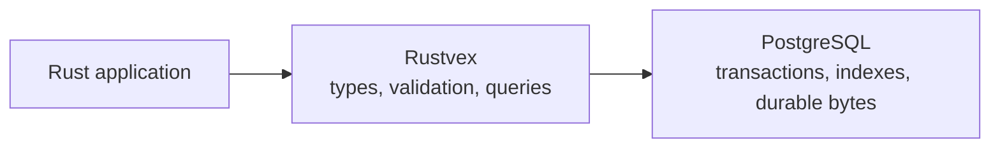
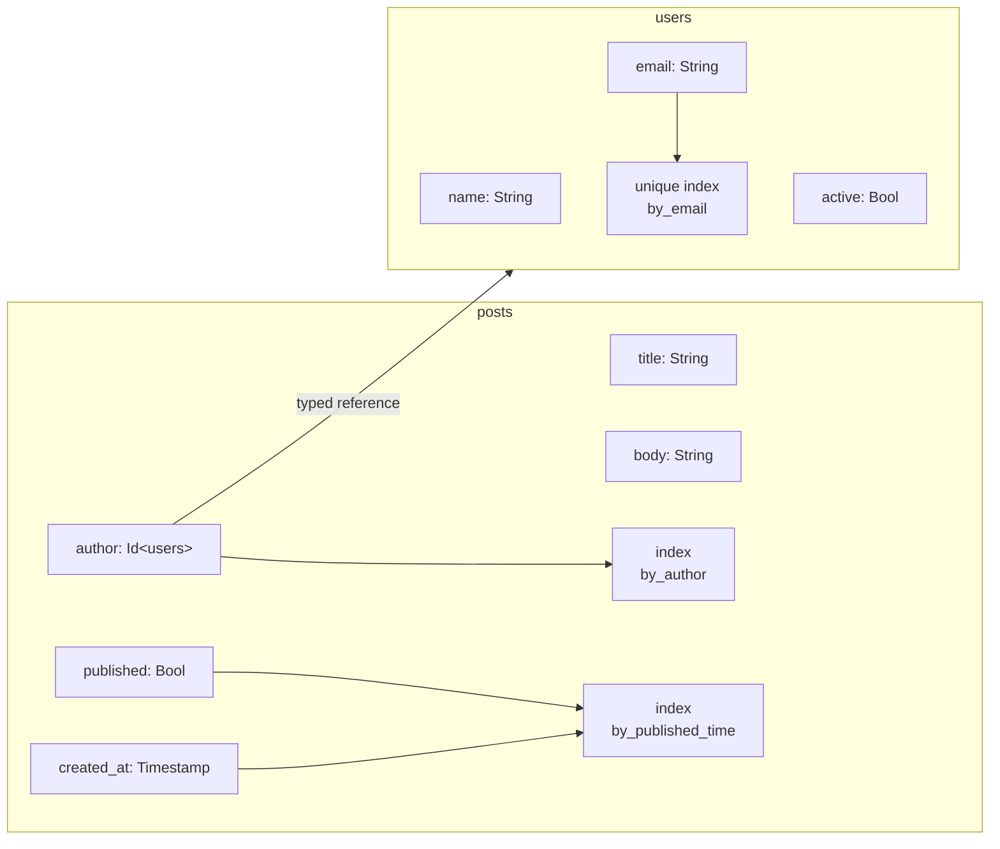
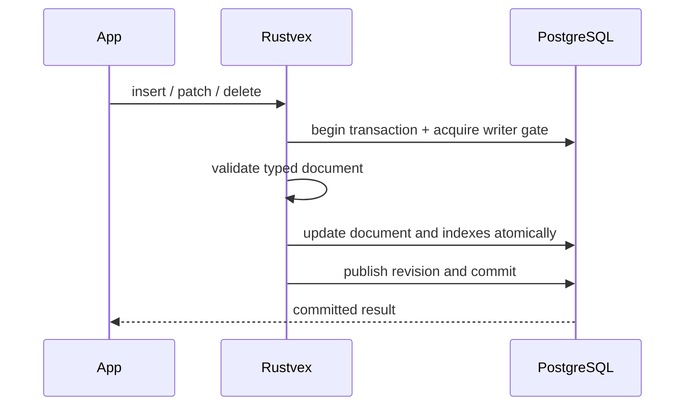

# Rustvex

Rustvex is a proposed Rust-native document database built on PostgreSQL. It aims
to combine a small typed schema, predictable indexed queries, atomic mutations,
and realtime subscriptions while leaving durable storage and transactions to
PostgreSQL.

> [!IMPORTANT]
> Rustvex is currently a design, not a working crate. This repository contains
> the v1 specification and does not yet contain an implementation.

## The basic idea



Rustvex owns the logical database behavior. PostgreSQL owns reliable physical
storage. A logical `users` table does **not** become a PostgreSQL `users` table;
Rustvex stores all logical documents in a small set of generic physical tables.

## A small schema

```rust
schema! {
    users {
        name: String,
        email: String,
        active: Bool,

        unique index by_email(email),
    }

    posts {
        title: String,
        body: String,
        author: Id<users>,
        published: Bool,
        created_at: Timestamp,

        index by_author(author),
        index by_published_time(published, created_at),
    }
}
```

Visually, that schema looks like this:



`Id<users>` prevents a post ID from being used where a user ID is expected. It
is a typed reference, not an automatic existence check or cascading foreign
key.

### Reading the field syntax

| Syntax | Meaning |
|---|---|
| `String` | Required, non-null string |
| `Number?` | Optional number; the field may be missing |
| `Nullable<String>` | Required field that may contain null |
| `Nullable<String>?` | Field may be missing, null, or a string |
| `Id<users>` | ID that can only refer to the `users` logical table |
| `index by_author(author)` | Ordered index that may contain duplicate keys |
| `unique index by_email(email)` | Index that rejects duplicate present, non-null keys |

Missing and null are intentionally different values.

## Basic document operations

The proposed v1 API covers the usual document lifecycle:

```rust
let user_id = db.insert(users, values! {
    name: "Ada Lovelace",
    email: "ada@example.com",
    active: true,
}).await?;

let user = db.get(user_id).await?;

db.patch(user_id, patch! {
    active: false,
}).await?;

db.delete(user_id).await?;
```

Indexed queries name the index explicitly, making the scan and its ordering
predictable:

```rust
let recent = db.query(posts)
    .with_index(posts.by_published_time, |q| {
        q.eq(posts.published, true)
         .gte(posts.created_at, start)
    })
    .descending()
    .take(50)
    .await?;
```

## What happens on a write



V1 deliberately allows one active writer transaction per Rustvex database.
Readers remain concurrent and see a consistent PostgreSQL snapshot.

## Planned v1 scope

- Typed documents, IDs, fields, and indexes
- Insert, get, patch, replace, and delete
- Explicit equality and range queries
- Atomic multi-document mutations
- Unique indexes maintained by Rustvex
- Commit-ordered revisions and change consumption
- Single-table realtime subscriptions
- Controlled schema evolution and resumable index backfills

V1 does not target joins, full-text or vector search, historical snapshot reads,
offline mutation merging, or concurrent writers.

## Design documents

- [Architecture specification](ARCHITECTURE.md) — complete v1 behavior,
  invariants, storage model, and implementation plan
- [Authentication and authorization](AUTH.md) — application-layer auth patterns
  and security boundaries

